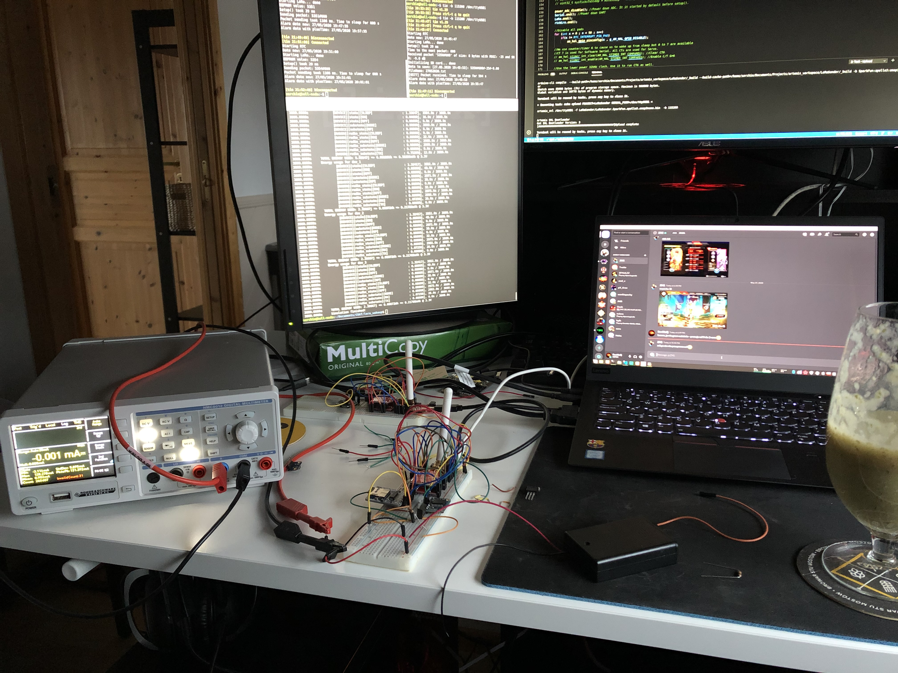
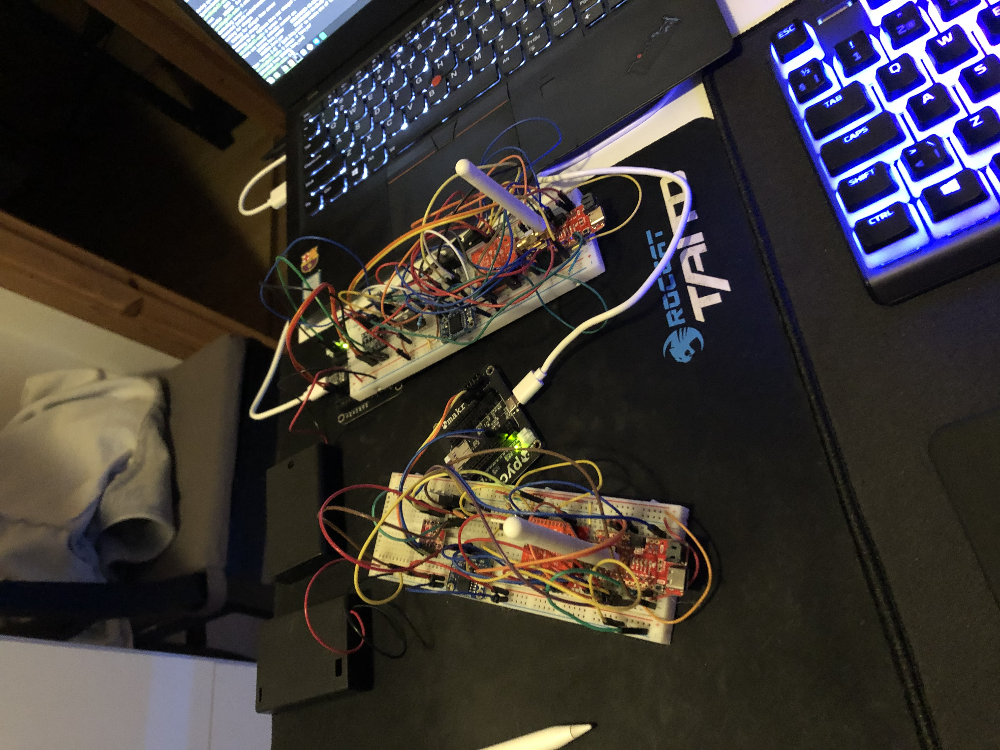
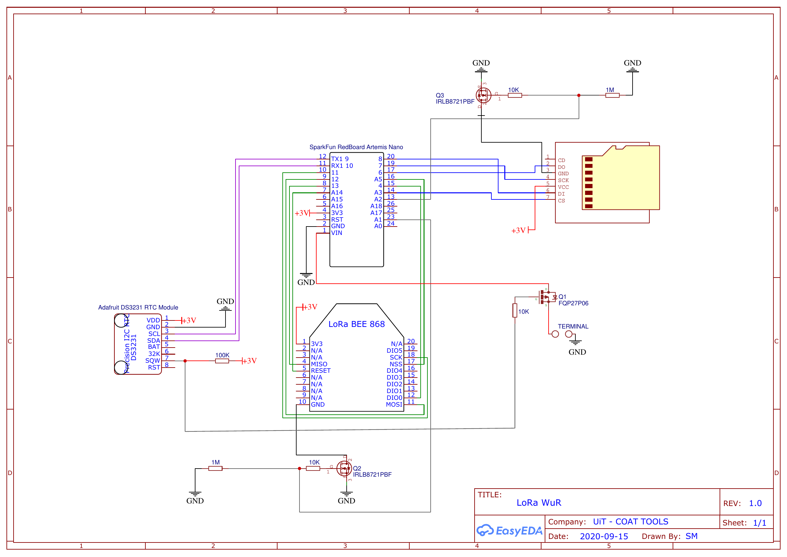

# LoRaLitE Simulator version 2

## Installation

There are two packages that are required to setup and run LoRaLitE simulator:
- pyenv
- poetry

python 3.10.6 has to be installed via pyenv and setup as the local python interpreter for the simulator:
```
pyenv install 3.10.6
pyenv local 3.10.6 # in the LoRaLitE code folder
```

The virtualenvironment and dependencies of the simulator are setup by `poetry install` command. When it is done the virtualenvironment can be activated by issuing the following command: `poetry shell`.

## Running simulation

Please take a look at simulator.py file and all argparse.ArgumentParser arguments and options that can be passed to the simulator.
An example configuration is also provided in the config.json file.

To run a simulation with the example configuration it is enough to execute `python3 simulator.py configs/config.json`.


## Running multiple simulations with different parameters simultaneously

The repository contains a bash script `experiments.sh` that can be used to execute multiple simulations simultaneously. The script takes a text file with all the simulations to execute.

The simulations that were used to obtain some interesting results and to verify assumptions related to a clock drift can be found in configs/experiments/.

To check progress of the running simulations `python3 progress.py data/` can be used.

In some cases a simulation producess a really big log file. In order to get only simulation results and energy consumption data, the following line `logger = Logger(log_level=INFO, forced=False)` has to be changed to `logger = Logger(log_level=ONLY_ALWAYS, forced=False)` in `simulator.py`. The alternative is to run the simulator as it is and just run `python3 compress.py data/` afterwards which will extract useful data from log files and compress them using pbzip2.

## Description of the simulator parameters

TODO

## LoRaLitE Nodes

Real node data vs simulation results:


Debugging prototypes:


Node schematic:


Link to the first version of the LoRaLitE simulator:
- [github](https://github.com/arcticobservatory/loralite)


## LoRaLitE publication (based on the first version of the protocol and the simulator)

Publication title: LoRaLitE: LoRa protocol for Energy-Limited environments

Authors: Lukasz Sergiusz Michalik, Loic Guegan, Issam Raïs, Otto Anshus and John Markus Bjørndalen

DOI: [10.1109/MASCOTS56607.2022.00018](https://doi.org/10.1109/MASCOTS56607.2022.00018)